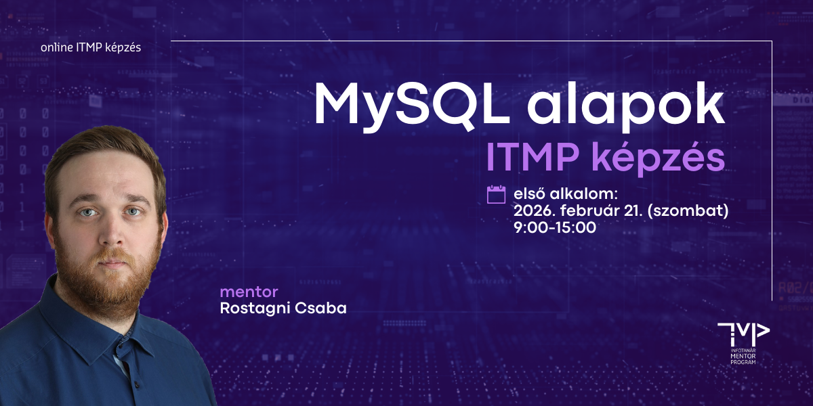

# Adatbázis-kezelés alapjai (MySQL)
## ITMP Klub képzés infotanároknak

**A továbbképzés időpontja:** 2026. február 21. (szombat) 9:00-15:00

**A továbbképzés formája:** online (Microsoft Teams meeting)

**A képzés tervezett tematikája és ütemezése:**

| Időpont           |Téma                                                              |
|-------------------|------------------------------------------------------------------|
| *09:00 - 09:15*   | *Köszöntő, technikai információk*                                |
